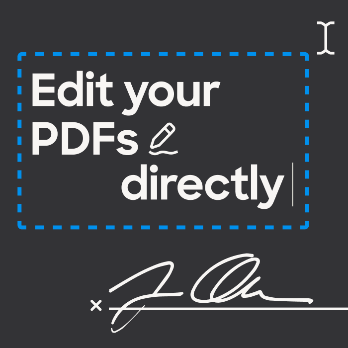

+++
title = "Новости Firefox на 26 октября 2022"
draft = false
date = "2022-10-26T08:27:28.661Z"
tags = [ "firefox" ]
+++

## Приватный режим

В последней версии браузера реализовано автоматическое включение темного оформления браузера в ркнах приватного режима. Так что теперь сразу понятно, что поиск ведется в окне которое не сохраняет историю поиска. Кстати, если часто пользуются приватные она, то теперь можно закрепить приватное окно на панели задач Windows. Так что теперь их можно будет открывать в один клик. Главно не авторизоваться в поиске Yandex или Google в приватных окнах %) а то весь смысл приватности теряется. При этом трэкинг и фингерпринт никто не отменял и персональные рекомендации могут всё-таки приходить. Главное что на устройстве с которого серфинг происходит не смогут просмотреть историю.

## Firefox редактировать PDFs

Теперь не нужно искать программу которая поможет заполнить форму PDF. С новым обновлением в Firefox добавили возможность редактировать PDF файлы.

## Копирование текста с изображений

Для пользователей версии на macOS добавили функцию позволяющую копировть текст прямо с изображений. Firefox теперь распознает текст на изображениях и позволяет копировать, выделить и встевать его. Функция даже распознает заглавные буквы, так что скопированный текст даже не требуется дополнительно изменять.
