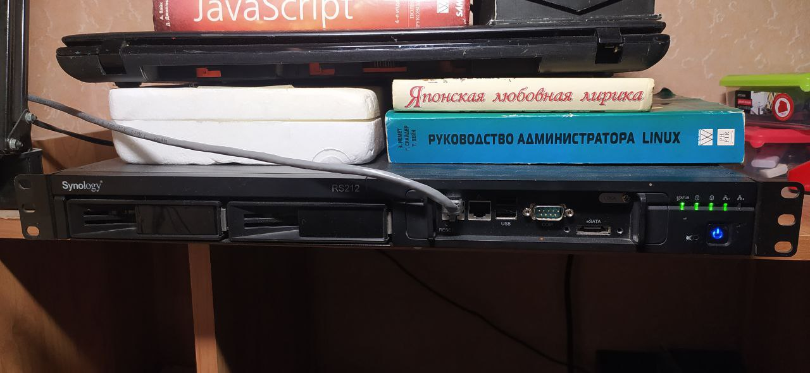
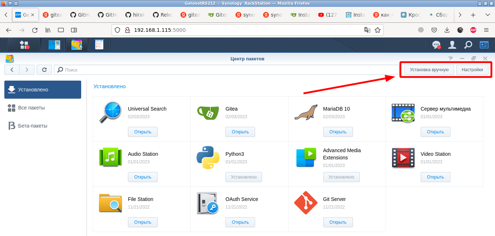
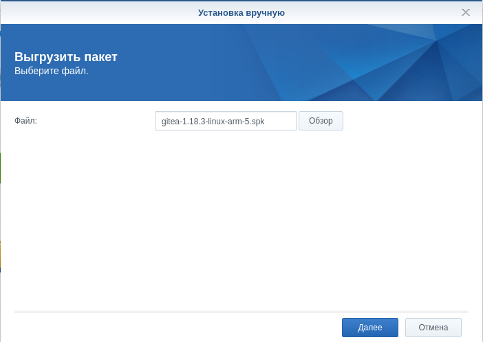
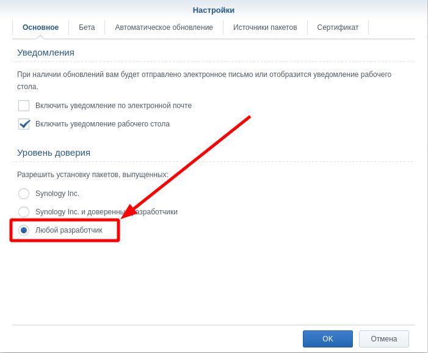
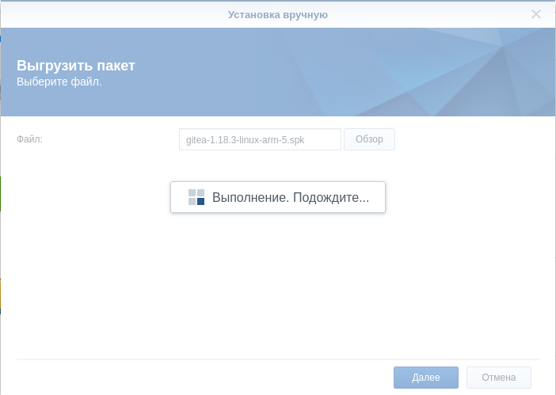
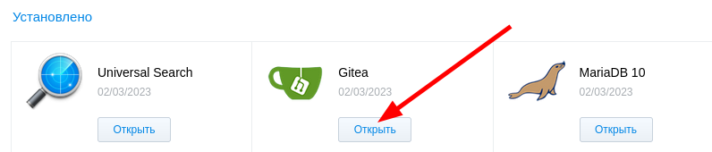

Имеется у меня старичок NAS Synology RS212 и возникла потребность в собственном git сервере с возможностью прицепить к нему CI инструмент. Поскольку Gitlab ни прикаких вариантах на этот NAS не встанет, то я нашёллегковесную альтернативу - [Gitea](https://gitea.io), у которой есть замечательная связка с Drone CI. А последний как раз замечательно можно поднимать на своём ноутбуке - это stateless блок в моей схеме работы будет.

Собственно, почему и Git локальноне поднимаю? А для сохранности и возможности круглосуточной работы сервиса.

## Что сабой представляет RS212?


Внутри 32х битный процессор ARMv5TE Marvell Kirkwood 88F6282 Single Core 1 Thread, No FPU, Package Arch -  88f628x и всего лишь DDR3 256 MB ОЗУ.

```shell
kpa39l@GelonetRS212:~$ cat /proc/cpuinfo 
Processor	: Feroceon 88FR131 rev 1 (v5l)
BogoMIPS	: 1589.24
Features	: swp half thumb fastmult edsp 
CPU implementer	: 0x56
CPU architecture: 5TE
CPU variant	: 0x2
CPU part	: 0x131
CPU revision	: 1

Hardware	: Synology 6282 board
Revision	: 0000
Serial		: 0000000000000000

kpa39l@GelonetRS212:~$ cat /proc/meminfo 
MemTotal:         249428 kB
MemFree:           19836 kB
Buffers:            6684 kB
Cached:            73308 kB
SwapCached:        13080 kB
Active:            87436 kB
Inactive:          97956 kB
Active(anon):      51112 kB
Inactive(anon):    58260 kB
```

Вот на этой машине и буду разворачивать Gitea, благо пакет с Git всё-таки в наличии.
Увы и ах, для этой старой машинки нет готового пакета с Docker-ом и простой способ развернуть решение в контейнерах. Зато [быстрый поиск](https://yandex.ru/search/?text=gitea+synology+package&from=os&clid=1836587&lr=10990) в Сети показал наличие инструмента для подготовки установочного пакета Gitea. чем я дальше и займусь.

С подготовой пакета возник ряд сложностей. Пришлось немного поковыряться. При использовании готового бинарника [с сайта проекта](https://github.com/go-gitea/gitea/releases/) сервис не поднялся с сообщением в логе: 

```shell
FATAL Kernel too old
```

К счастью, проблема была описана и решена [https://github.com/go-gitea/gitea/issues/4131](https://github.com/go-gitea/gitea/issues/4131). И достаточно скомпилировать бинарник из исходников.

## Собираем бинарник Gitea

Тут все прошло без необжиданностей, четко по гайду [Installation from source](https://docs.gitea.io/en-us/install-from-source/). Но после установки пакета сервис опять не запустился. На этот раз в логе была вот такая причина:

```shell
Failed to start server: accept tcp [::]:3000: accept: function not implemented
```

Мне опять повезло и причина быстро [определилась](https://github.com/syncthing/syncthing/issues/8325?ysclid=ldoizlc6xv762829487). Все дело было в том, что системный вызов accept в текущих версиях GO на старых архитектурах не работал. Проблема была сформулирована и направлена разработчикамх[https://github.com/golang/go/issues/57333](https://github.com/golang/go/issues/57333) В итоге достаточно было обновить пакет golang до версии выше чем 1.19.5.

### Установка последней версии Go на Debian 10

Тут вообще все свелось к [нескольким командам](https://golangify.com/install-on-debian-10?ysclid=ldom4dd66v135639551). Скачать архив ,распаковать,назначить владельца и скопировать содерижмое архива в нужное место. Благо все PATH уже были настроены до этого.

```bash
kpa39l@hp15:~$ curl -O https://dl.google.com/go/go1.20.linux-amd64.tar.gz
kpa39l@hp15:~$ tar xvf go1.20.linux-amd64.tar.gz
kpa39l@hp15:~$ sudo chown -R root:root ./go
kpa39l@hp15:~$ sudo rm -R /usr/local/go 
kpa39l@hp15:~$ sudo mv go /usr/local 
```

### Установка последней версии Node.js на Debian 10

Node.js в репозитории дистрибутива тоже сильно несвежий - 12, в нам нужна версия не ниже 16. Поэтому устанавливаю руками по [гайду](https://www.digitalocean.com/community/tutorials/how-to-install-node-js-on-debian-10):

```shell
kpa39l@hp15:~$ curl -fsSL https://deb.nodesource.com/setup_16.x | sudo -E bash -
kpa39l@hp15:~$ sudo apt install nodejs
kpa39l@hp15:~$ node -v
v16.19.0
```

Готово. Наконец-то приступаем к компиляции бинарника.

### Компиляция

Как и говорилранее,тут всё идет чётко по [гайду](https://docs.gitea.io/en-us/install-from-source/). Я собирать буду последнюю версию, так что это еще уменьшит количество команд.
Получаем исходный код

```shell
kpa39l@hp15:~$ git clone https://github.com/go-gitea/gitea
kpa39l@hp15:~$ cd gitea
```

Поскольку исполняться код будет на процессоре с отличной от моего ноутбука архитектурой, так называемое кросс-компилирование, то определяем [переменные среды](https://go.dev/doc/install/source#environment). Для процессора моего RS212 это будут:

```bash
GOOS=linux GOARCH=arm GOARM=5
```

Ну комманду сборки подсмотрим в [гайде](https://docs.gitea.io/en-us/install-from-source/). Нам нужен один статический бинарник и возможность работать снеболшими репозиториями малой командой влицеодного меня.

```bash
TAGS="bindata sqlite sqlite_unlock_notify" make build
```

Собираем все вместе:

```bash
kpa39l@hp15:~/gitea$ GOOS=linux GOARCH=arm GOARM=5 TAGS="bindata sqlite sqlite_unlock_notify" make build
```

Запускаем и уходим ставить чайник. На моём ноуте компиляция заняла минут 15. Как результат - исполняемый файл с именем gitea на 87 мегабайт. 

## Собираем пакет Synology

Вот она - финишная прямая. Собираем пакет для установки через NAT по очередной [инструкции](https://github.com/flipswitchingmonkey/gitea-spk?ysclid=ldnu7pg1s0336729498).

Клонируем репозиторий не меняя рабочую директорию.

```shell
kpa39l@hp15:~/gitea$ git clone https://github.com/flipswitchingmonkey/gitea-spk.git
```

Приводим в соотвествие имя полученного на предыдущем шаге исполняемого файла из gitea в gitea-1.18.3-linux-arm-5(версия 1.18.3 была актуальной на момент написания заметки), потому что скрипт пакета выдергивает из названия нужные ему параметры. Меняем рабочий каталог и запускаем скрипт сборки установочного пакета

```shell
kpa39l@hp15:~/gitea$ mv ./gitea ./gitea-spk/gitea-1.18.3-linux-arm-5
kpa39l@hp15:~/gitea$ cd gitea-spk
kpa39l@hp15:~/gitea$ ./create_spk.sh
```

Результатом будет файл с именем соответствующим имененм используемого бинарного файла gitea-1.18.3-linux-arm-5.spk


## Установка пакета на Synology NAS

К моему сожалению, устанавка новых пакетов из консоли ssh не предусмотрена. По крайней мере в [инструкции администратора по командной строке Synology DiskStation](Synology_DiskStation_Administration_CLI_Guide.pdf) об это нет ни слова. Поэтому открываем страницу управления и заходим в центр управления пакетами. У меня gitea уже установлена, а так нам понадобится двекнопки вправом верхнем углу.



Сначала нужно убедиться что разрешена установка пакетов для всех разработчиков нажавкнопку "Настройки"



Потом выбираем через кнопку "Установка вручную" окрывам диалог загрузкисозданного нами ранее пакета.



И теперь ждём. Это дело небыстрое...хотя чаю попить и не удастся.



После установки приложение стартуе автоматически, если в галку поставить в окне, которое появится после старта установки.

И наконец-то, после того как установка завершится, появится пнопка "Открыть"



Вуаля. Задача по установке Gite на NAS Synology DiskStation RS2012 выполнена!
